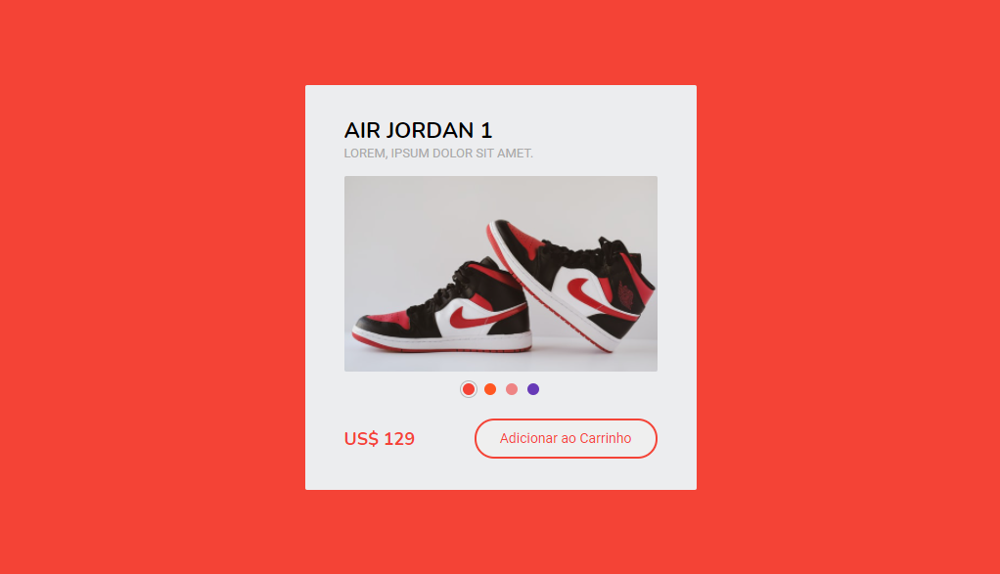

  

## About the component

  Presenting itself as an example of a product card, the following component uses the global attribute "data-", which is assigned to the elements of the transition bar, so that, when they are clicked, it defines, through JQuery, the URL of the product image and the value of the background color of the page.

## README versions

  <a href="https://github.com/ThiagoBrito-Dev/product-card-example/blob/main/README.md">
    Portuguese (pt-br)</a>
  |   
  <a href="https://github.com/ThiagoBrito-Dev/product-card-example/blob/main/README-en.md">
    English (en-us)</a>

