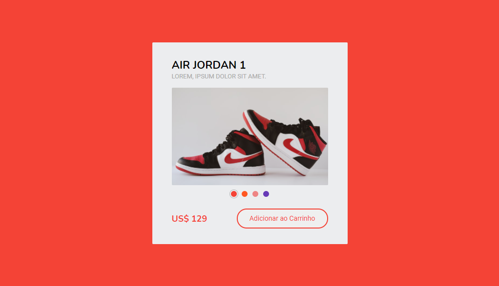

  

## Sobre o componente

  Tratando-se de um exemplo de cartão de produto, o seguinte componente utiliza o atributo global "data-", que é atribuído aos elementos da barra de transição, para, quando os mesmos forem clicados, definir, por meio do JQuery, a URL da imagem do produto e o valor da cor de fundo da página.

## README versions

  <a href="https://github.com/ThiagoBrito-Dev/product-card-example/blob/main/README.md">
    Portuguese (pt-br)</a>
  |   
  <a href="https://github.com/ThiagoBrito-Dev/product-card-example/blob/main/README-en.md">
    English (en-us)</a>

